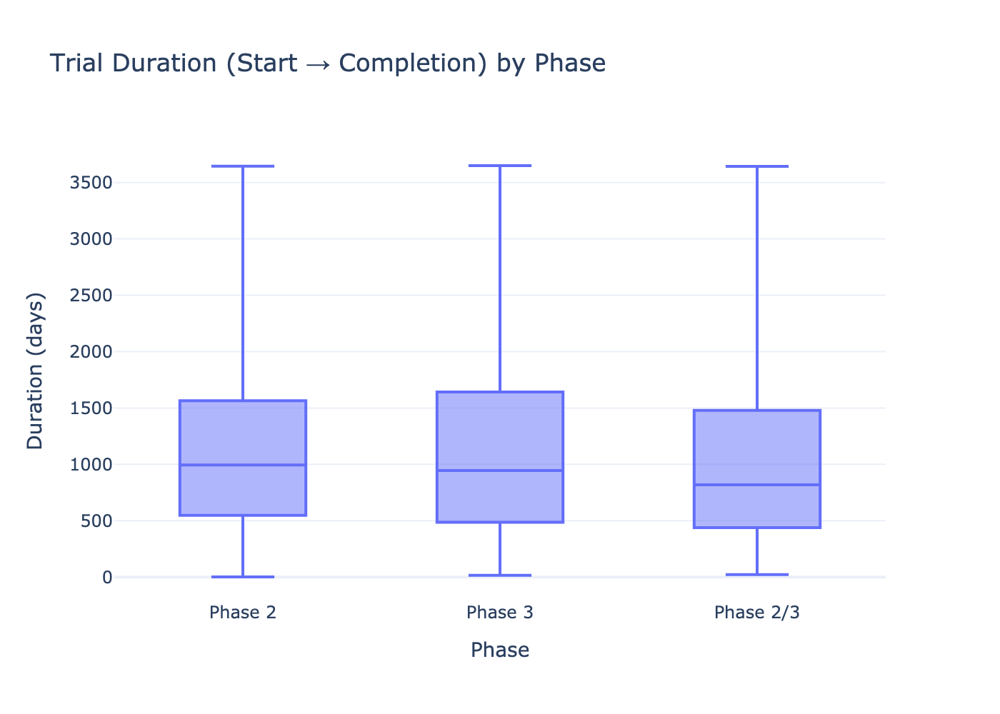
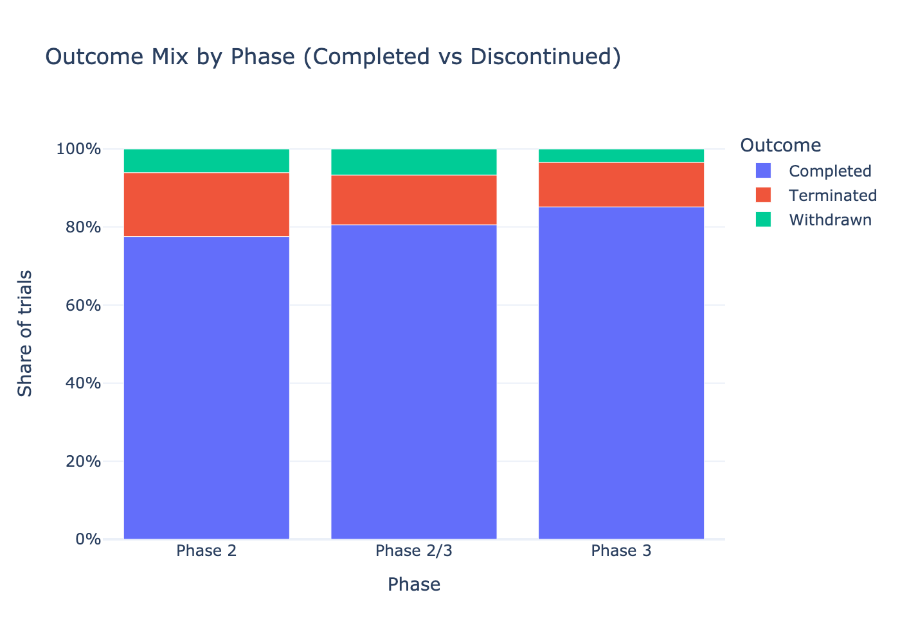
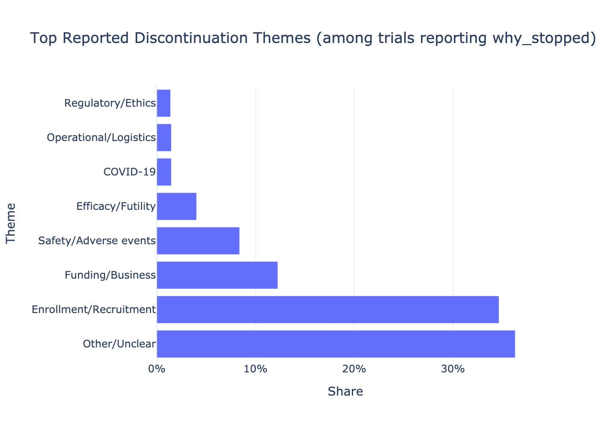
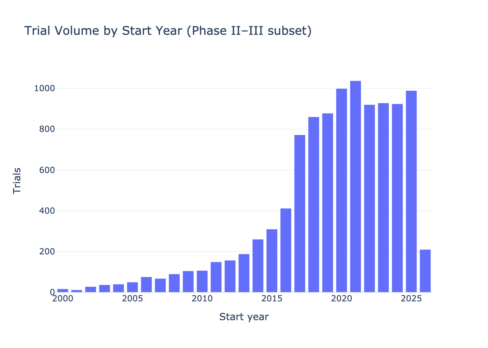
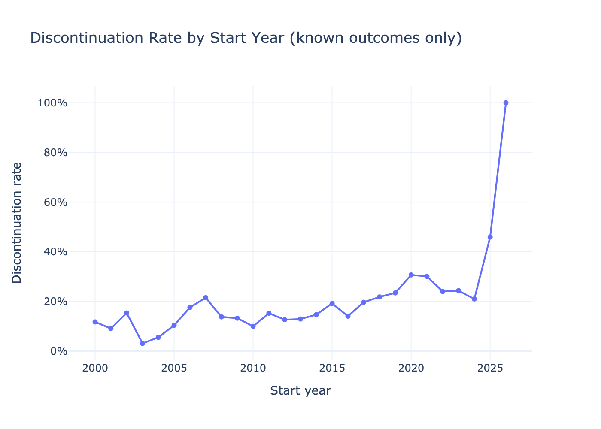

# TrialPulse — Clinical Trial Operations & Risk Analytics

**TrialPulse** is an analytics-first decision-support product for **clinical trial operations and portfolio leadership**, built using public **ClinicalTrials.gov** data.

The project focuses on **Phase II–III interventional trials** and answers practical operational questions around:

- trial timelines  
- enrollment risk  
- discontinuation patterns  
- sponsor and indication differences  
- geographic execution complexity  

This project combines **descriptive operational analytics with formal statistical modeling in SAS** to quantify discontinuation risk and execution complexity drivers, while maintaining interpretability, reproducibility, and executive-ready insights.

---

## Why this project?

Clinical trial teams make high-stakes decisions under uncertainty:

- How long should we expect trials to run?  
- Which enrollment profiles are higher risk?  
- Where do trials most commonly fail?  
- How does sponsor type, indication, or geography affect outcomes?  

TrialPulse translates messy public registry data into **clear operational signals** that support:

- feasibility assessments  
- portfolio reviews  
- early risk identification  
- operational risk quantification  

---

## Data Source

- **ClinicalTrials.gov API (v2)**
- ~25,000 Phase II–III interventional trials
- Public metadata only (no patient-level data)

Key fields include:

- trial status and outcomes  
- start / completion dates  
- enrollment size and type  
- sponsor classification  
- condition area  
- intervention characteristics  
- geographic footprint  
- reported termination / withdrawal reasons  

---

## Project Structure

```
trialpulse/
├── app/                     # Streamlit dashboard
│   └── app.py
├── notebooks/               # End-to-end analytics pipeline
│   ├── 01_data_ingest.ipynb
│   ├── 02_flatten_qc.ipynb
│   ├── 03_feature_engineering.ipynb
│   └── 04_analysis_visuals.ipynb
├── src/                     # Shared utilities
│   └── __init__.py
├── sas/
│   └── programs/
│       ├── 00_setup.sas                    # Library assignment and project configuration
│       ├── 01a_file_check.sas              # Input validation and dataset inspection
│       ├── 01b_fix_obs_and_rebuild.sas     # Data cleaning and observation correction
│       ├── 01_import_build.sas             # Initial dataset build workflow
│       ├── 01_import_build_FINAL.sas       # Finalized analysis-ready dataset creation
│       ├── 02_tables.sas                   # Descriptive summaries and KPI tables
│       ├── 03_modeling.sas                 # Multivariable logistic regression model
│       └── 04_statistical_tests.sas        # Chi-square, Kruskal-Wallis, trend tests
├── data/
│   ├── raw/
│   ├── interim/
│   └── processed/
├── reports/
│   ├── figures/
│   └── tables/
├── README.md
├── requirements.txt
└── .gitignore
```

---

## Key Questions Answered

1. **Timeline**  
   How long do Phase II vs Phase III trials take?

2. **Enrollment Risk**  
   Which enrollment profiles are associated with higher discontinuation risk?

3. **Outcomes**  
   How do completion and discontinuation rates differ across sponsor classes?

4. **Discontinuation Drivers**  
   What themes dominate termination and withdrawal reasons?

5. **Geography & Complexity**  
   How does multi-country execution affect cycle time and operational burden?

6. **Trends Over Time**  
   How have trial volumes and discontinuation rates evolved?

---

## Outputs

- **9 executive-quality visualizations** → `reports/figures/`
- **KPI and summary tables** → `reports/tables/`
- **Streamlit dashboard**
  - interactive filters
  - KPI cards
  - embedded figures
  - downloadable outputs
- **SAS statistical modeling outputs**
  - hypothesis testing results
  - logistic regression models
  - ROC diagnostics
  - nested model comparisons

---

## Selected Visual Insights

### Trial Duration by Phase


*Phase III trials exhibit longer and more variable cycle times than Phase II.*

---

### Outcome Mix by Phase


*Completion and discontinuation rates vary meaningfully across development phases.*

---

### Top Discontinuation Themes


*Enrollment, funding/business, and safety are dominant termination themes.*

---

### Trial Volume Over Time


### Discontinuation Rate Over Time


*Recent-year discontinuation trends should be interpreted cautiously due to right-censoring.*

---

# Advanced Statistical Modeling (SAS)

In addition to descriptive analytics, a formal statistical modeling framework was implemented in **SAS** using:

- `PROC FREQ`
- `PROC NPAR1WAY`
- `PROC LOGISTIC`

---

## 1️⃣ Hypothesis Testing

### Sponsor Type × Discontinuation
- χ²(3) = 20.69  
- p = 0.0001  
- Cramer’s V = 0.03 (small effect size)

### Trial Duration by Phase
- Kruskal–Wallis χ²(3) = 55.01  
- p < 0.0001  

### Enrollment Trend
- OR = 0.475 per category increase  
- p < 0.0001  

Larger enrollment targets are significantly associated with lower discontinuation risk.

---

## 2️⃣ Multivariable Logistic Regression

**Outcome:** Trial discontinuation (terminated/withdrawn)

**Predictors:**
- Phase
- Sponsor type
- Multi-country design
- Enrollment size
- Calendar start year

**Model Performance:**
- C-statistic (AUC) ≈ 0.73
- Significant likelihood ratio test (p < 0.0001)
- ΔAIC ≈ 30 improvement over intercept-only model

---

## 3️⃣ Adjusted Findings

After covariate adjustment:

- Industry-sponsored trials had >2× higher odds of discontinuation vs Government
- NIH-sponsored trials had ~2× higher odds vs Government
- Multi-country trials had ~26% higher adjusted odds
- Larger enrollment targets were protective
- Discontinuation risk decreased over calendar time
- No significant Phase × Sponsor interaction detected

---

## 4️⃣ Model Diagnostics

- ROC analysis confirmed acceptable discrimination (AUC ≈ 0.73)
- Nested model comparison validated sponsor contribution
- Quasi-complete separation identified in sparse interaction models and appropriately handled

---

## Dashboard

Run locally:

```bash
conda activate trialpulse
streamlit run app/app.py
```

Dashboard reads from pre-computed outputs to ensure reproducibility and fast execution.

---

## Limitations & Data Quality Notes

- Registry reporting is not uniform
- Missingness required complete-case modeling in SAS
- Right-censoring affects recent-year duration and discontinuation estimates
- Findings are directional and operational — not causal inference

---

## Intended Audience

- Clinical Data Analyst roles  
- Clinical Operations & Feasibility teams  
- Healthcare / Life Sciences Analytics  
- Biostatistics or Epidemiology support roles  
- Real-World Evidence analytics  

---

## Author

**Deepika Sarala Pratapa**  
M.S. Applied Data Science  
Focused on clinical analytics, healthcare data science, and reproducible modeling workflows.

Email: deepikapratapa27@gmail.com  
LinkedIn: https://www.linkedin.com/in/deepika-sarala-pratapa/  
GitHub: https://github.com/deepikapratapa
